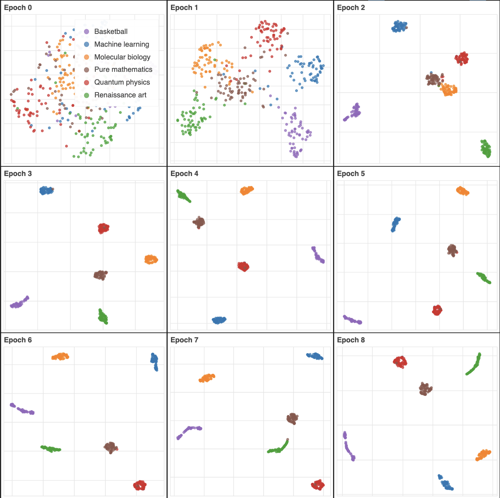
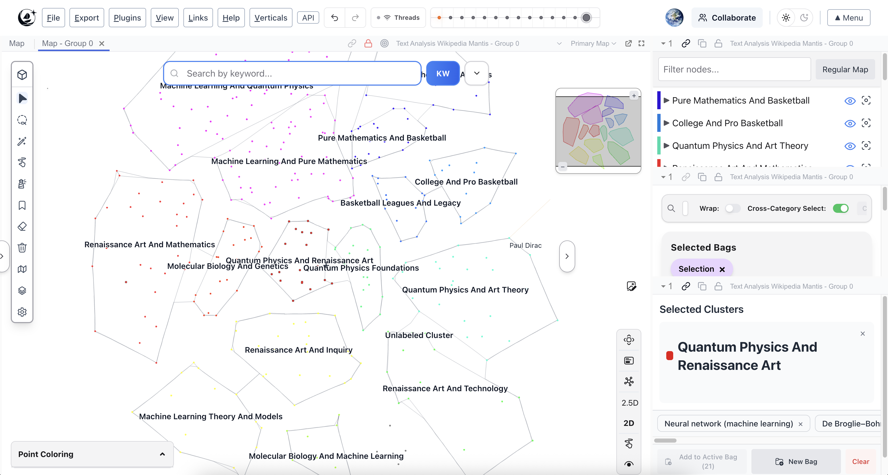

# MIT 6.390: Lab 8 – Representation Learning & Visualizing Latent Spaces

By Aditya Sengupta, Professor Manolis Kellis, & Professor Shen Shen

Welcome to **Lab 8**! In this lab, you will dive into the core of how neural networks build internal representations of data. Rather than treating a neural network as a black box that spits out a classification, you will extract the high-dimensional activations from the penultimate layer of your model and track how these "embeddings" evolve throughout the training process. 

<div align="center">
  
  <br>
  <em>Tracking how the network geometrically sculpts distinct semantic concepts from a chaotic random initialization (Epoch 0) into highly structured linear space (Epoch 10).</em>
</div>


Finally, you will import your custom datasets into [Mantis](https://mantis.csail.mit.edu/) to visually sculpt and explore how your neural network learned to organize conceptual data in real-time.

---

## 📖 Lab Overview

A "representation" in machine learning is the way a model transforms raw input (pixels or words) into a structured vector space where similar concepts are clustered together. 

This repository contains all the materials necessary to complete the lab. It is divided into two phases:
1. **Offline Representation Learning (Jupyter Notebooks):** Train a text or image classification model. We attach a "hook" inside the neural network architecture to freeze and capture the multi-dimensional latent space at 11 different training stages (Epoch 0 before training begins, through Epoch 10).
2. **Interactive Visual Exploration (Mantis):** Upload the generated CSV files into a 3D visualizer to analyze how the concepts successfully separate or collapse due to gradients over time.

---

## 📂 Repository Structure

```text
~/
├── notebooks/
│   ├── part1_text_classification.ipynb          # Primary Lab: Dynamic Wikipedia article fetching
│   ├── part1_text_classification_alt.ipynb      # Alternative: BBC News Classification dataset
│   └── part1_image_classification.ipynb         # Alternative: CIFAR-10 image classification
├── Assignment-Worksheet/                        # Assignment sheets for students
│   ├── lab8_assignment.tex                      # Questions and Theory (LaTeX format)
│   ├── lab8_assignment_solutions.tex            # Answer Key 
├── worksheets/                                  # Image assets and raw lab materials
├── generate_notebooks.py                        # Tooling to re-generate the notebooks
└── README.md                                    # You are here
```

---

## 🚀 Phase 1: Training & Capturing Embeddings

### Getting Started
We recommend starting with `notebooks/part1_text_classification.ipynb`. This notebook searches the live Wikipedia API without any pip-dependency overhead, allowing you to train your network on *any topics you find interesting* (e.g., "Quantum physics", "Renaissance art"). 

1. Open the notebook in **Jupyter** or **Google Colab**.
2. Run the cells sequentially. 
3. *Notice the Hook*: Study how the `TextClassifier` architecture stores `self.embeddings = out.detach().cpu().numpy()` right before applying the final linear classifier.
4. The notebook will automatically save the text files into an organized `wikipedia_articles/` folder so you can read what the model is reading, and output a large file called `text_analysis_wikipedia_mantis.csv`.

### Output CSV Format
The output CSV is already heavily formatted for the Mantis Visualizer platform:
- `title` and `categoric`: Used for point labels and coloring.
- `embedding_epoch_0` to `embedding_epoch_10`: Array lists containing the raw high-dimensional coordinates across time.

---

## 🌌 Phase 2: Mantis Visualization

Once you have generated your CSV, it's time to visualize what the network actually learned.

<div align="center">
  
  <br>
  <em>The Mantis 3D Visualizer rendering a high-dimensional Latent Space mapping.</em>
</div>

<br>

1. Navigate your browser to the [Mantis Visualization Platform](https://mantis.csail.mit.edu/).
2. Drag and drop your newly created CSV file (`text_analysis_wikipedia_mantis.csv` or `image_analysis_mantis.csv`).
3. Select the `embedding_epoch_X` columns as your primary vector space.
4. Use UMAP to reduce the dimensions down to 3D. 

**What to look for:**
- **Epoch 0:** Since the network weights are randomly initialized, the articles should be an interspersed, chaotic cloud.
- **Epoch 10:** Distinct islands grouping similar semantic concepts (e.g., all "Machine Learning" articles clustered away from "Renaissance Art"). Observe the spaces *between* the clusters—are there overlapping nodes? What do they represent?

---

## 📝 Submitting the Lab
Please refer to `Assignment-Worksheet/lab8_assignment.tex` for the theory and coding questions that accompany this module. You are expected to answer both the conceptual questions and the coding questions comparing the model architectures. Submit your compiled PDF and resulting `.csv` file to Canvas.
